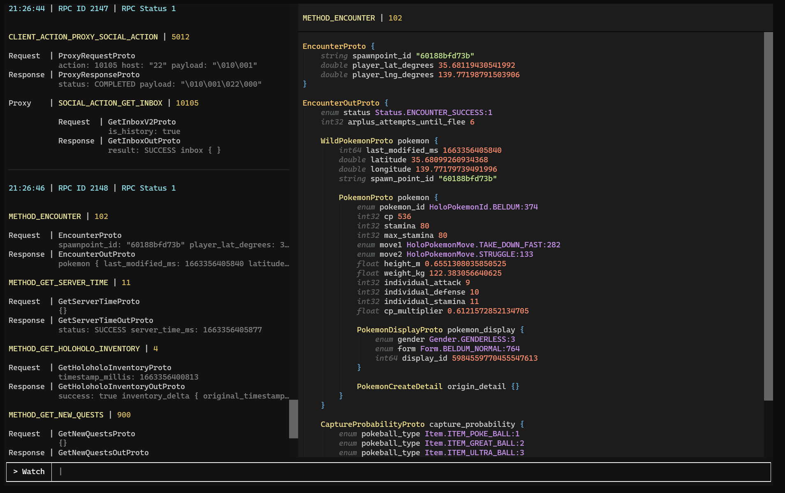
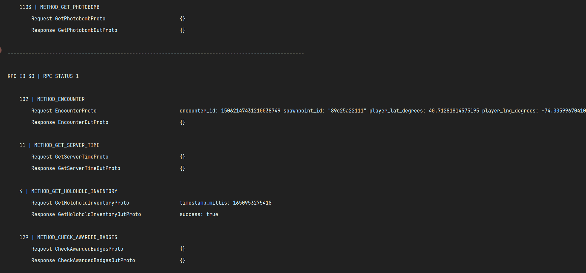
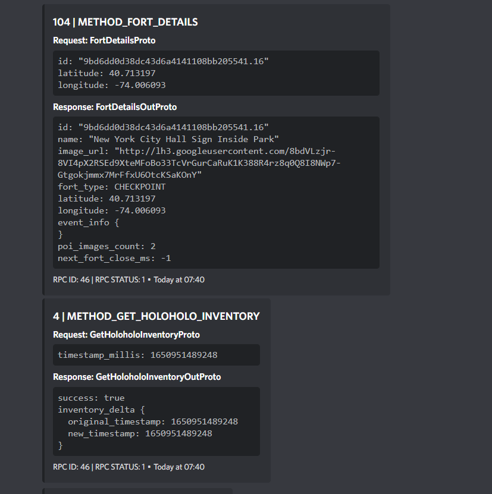

# 🚦 Traffic Light

Beautiful traffic logging for PGO. 

## Features

Traffic Light accepts specially formatted messages from a mitm app to display them nicely in several ways.

### 1. TUI



The best part of Traffic Light: An interactive Text User Interface in the Terminal. Log, filter and inspect requests.

### 2. Printing



A simple log of requests.

### 3. Discord



Webhooks in Discord

## Setup

- It's made to be used on your local computer with a local phone
- Clone repo, install requirements, copy `config.example.toml` to `config.toml`, fill out the config
- Open a supported MITM on your phone. Set POST destination to your endpoint from config.toml
(default: http://{computer IP}:3335)
- Run `trafficlight.py` and watch

### Supporting MITMs

If you want your own MITM to support Traffic Light, all it needs to do is for every request the game makes, 
send a POST request to a specified endpoint with the body looking as follows.

```json
{
    "rpcid": 1,
    "rpcstatus": 1,
    "protos": [
        {
            "method": 1,
            "request": "<b64 encoded string>",
            "response": "<b64 encoded string>"
        },
        {
            "method": 106,
            "request": "",
            "response": ""
        }
    ]
}
```

### Additional notes on TUI compatibility

The TUI uses the beautiful [Textual](https://github.com/Textualize/textual). 
Here's a copy from their docs on platform compatibility.

> ### Linux (all distros)
>All Linux distros come with a terminal emulator that can run Textual apps.
> ### MacOS
>The default terminal app is limited to 256 colors. We recommend installing a newer terminal such as iterm2, Kitty, or WezTerm.
> ### Windows
> The new Windows Terminal runs Textual apps beautifully.
